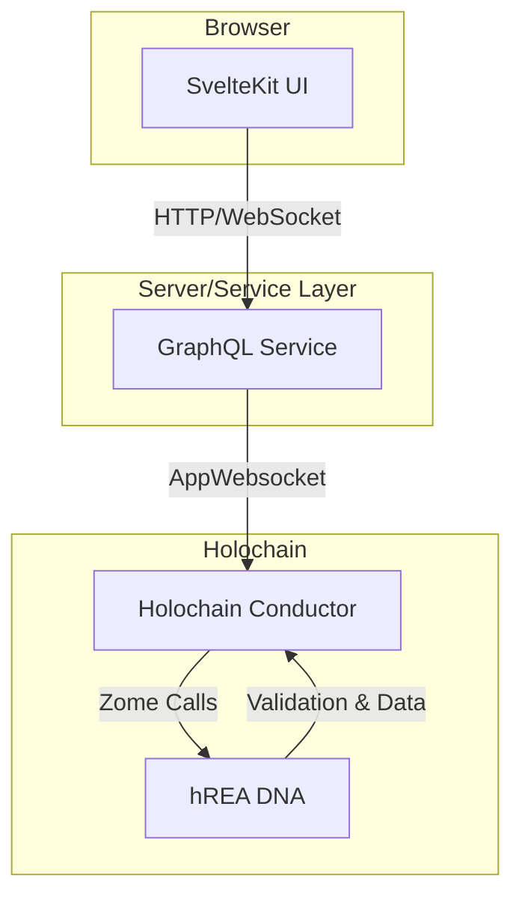
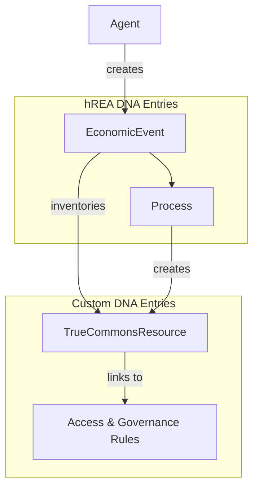

# System Architecture

## 1. High-Level Overview

The True Commons platform is built on a service-oriented architecture designed to separate the user interface from the backend logic. The current implementation consists of three main layers: a SvelteKit frontend, a GraphQL service, and a Holochain DNA for the backend.

## 2. Component Breakdown

### 2.1. The `TrueCommonsResource` Entry

The core of this architecture is the `TrueCommonsResource`, which is a **custom Holochain entry type**, not a native hREA type. It is a structured data object (a DHT entry) that represents the digital artifact itself.

-   **Content**: It stores metadata about the resource (name, description, etc.) and a hash that links to the actual content (e.g., a file on IPFS or another entry).
-   **Economic Linking**: Crucially, this custom entry is linked to the hREA framework. When a `TrueCommonsResource` is created or modified, a corresponding hREA `EconomicEvent` is generated, which in turn is linked to an hREA `Process`. This creates a full, auditable trail of economic activity around the resource.
-   **Governance**: The entry also links to its specific governance and access control rules.

### 2.2. User Interface (`ui/`)

-   **Framework**: A modern SvelteKit application responsible for all rendering and user interaction.
-   **State Management**: Uses Svelte 5 Runes for reactive state management.
-   **Core Logic**: A central service (`true_commons_service.svelte.ts`) orchestrates all communication with the backend. It abstracts away the details of GraphQL, providing a clean API for the UI components.
-   **Data Flow**: The UI does not directly communicate with Holochain. Instead, it sends queries and mutations to the GraphQL service.

### 2.3. GraphQL Service Layer

-   **Purpose**: This layer serves as an abstraction and a bridge between the frontend and the Holochain backend. It exposes a standardized hREA (ValueFlows) GraphQL schema.
-   **Function**: It receives requests from the UI, translates them into Holochain zome calls, and formats the responses back into GraphQL.
-   **Benefit**: This decoupling allows the UI to be developed independently and provides a clear, strongly-typed API contract, insulating the frontend from the complexities of direct zome calls.

### 2.4. Holochain DNA (`dnas/`)

-   **Language**: Written in Rust using the Holochain Development Kit (HDK).
-   **Architecture**: The current implementation uses a single DNA (`true_commons_dna`) that integrates hREA for economic modeling.
-   **Core Functionality**:
    -   Defines the custom `TrueCommonsResource` entry type.
    -   Integrates the hREA zomes to manage standard economic entries (`EconomicEvent`, `Process`, `Agent`, etc.).
    -   Contains the validation logic for all data written to the distributed hash table (DHT).
    -   Exposes zome functions that are called by the GraphQL service to perform CRUD operations on both custom and hREA entries.

### 2.5. Access Control

Access control is managed using core Holochain principles, as described in the project's source documentation:

-   **Capability-Based Security**: The primary mechanism for granting access. The owner of a resource can issue capability tokens to other agents, granting them specific, limited permissions (e.g., read, comment, propose modifications) without giving up ultimate control.
-   **Membranes**: The DNA can define a validation function that checks an agent's "membrane proof" before allowing them to join the network. This ensures that only authorized agents can participate.
-   **Lobby Pattern**: A common pattern where a public, open DHT (the "lobby") is used for discovery and initial contact. Agents in the lobby can then request access to a more private, privileged DHT where the actual work happens.

## 3. Future Vision (From `TRUE_COMMONS_ARCHITECTURE.md`)

The long-term architectural vision for this project is more expansive and includes:

-   **Multi-DNA Structure**: Separating concerns into distinct DNAs for resource management, collaboration, and governance.
-   **Advanced Collaboration**: Real-time collaborative editing and messaging.
-   **Complex Governance**: On-chain voting, rule management, and reputation systems.

The current architecture serves as the foundational first phase of this broader vision. 