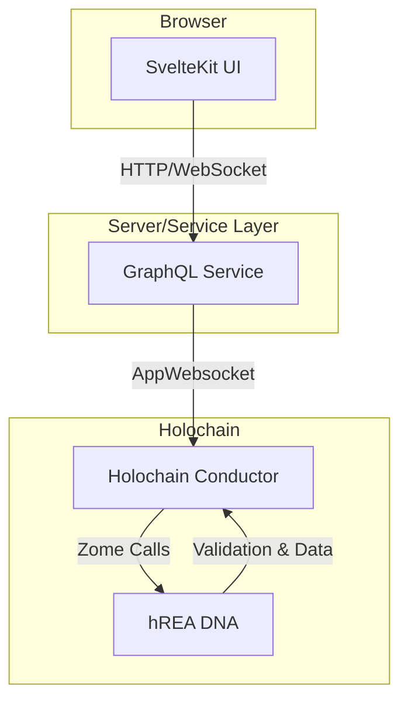
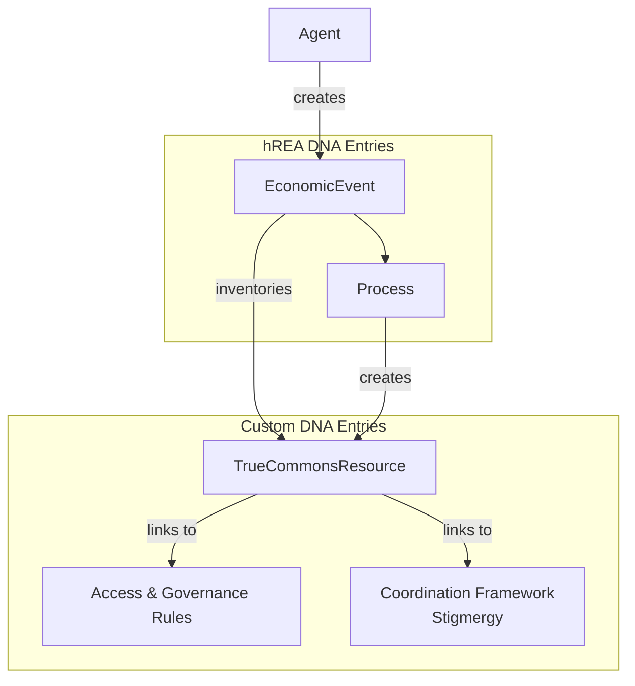

# True Commons Architecture


## High-Level Architecture

### DNA Structure

The system uses a multi-DNA architecture to separate concerns and enable flexible membrane management:

1. **Commons Registry DNA**: Global registry for discovering commons
2. **Resource DNA**: Core resource management with ValueFlows integration
3. **Collaboration DNA**: Real-time collaborative editing and messaging
4. **Governance DNA**: Voting and rule management

### Key Components

#### 1. Digital Resource Management
- **Resource Entry**: Core digital asset with metadata, content, and rules
- **Version Control**: Git-like versioning with branching and merging
- **Content Addressing**: Cryptographic content integrity
- **Access Control**: Capability-based permissions using Holochain's security model

#### 2. Economic Activity Tracking (ValueFlows)
- **Economic Events**: Track all interactions with resources
- **Economic Resources**: The digital assets themselves
- **Agents**: People and organizations interacting with resources
- **Processes**: Creation, modification, and usage workflows
- **Commitments**: Promises for future economic activity
- **Log**: a claim for contribution(s) that needs validation by peers in order to become a contribution. It describes what has been done, why and may include references to collaboratirs / withnesses. **Commitment** by an agent, validated by peers. 
- **Contributions**: An addition to a value stream of a resource to which paticipants attribute value. It is the fulfillment of a **Commitment** by an agent, validated by peers. 

#### 3. Collaboration System
- **Real-time Editing**: Operational Transform-based collaborative editing
- **Messaging**: Contextual discussions attached to resources
- **Forking/Branching**: Git-like workflow for parallel development
- **Merge Requests**: Peer review process for contributions

#### 4. Governance & Rules
- **Core group**: Membrane that grants priviledges to some agents, based on their merit
- **Benefit Redistribution Algorithm**: (BRA) Algorithm that turns past contributions into benefits. Among other benefits, BRAs grant access to the **Core group**. BRAs essentially instanciate a social contract between all contributors.
- **Rule Engine**: Smart contract-like rules embedded in resources
- **Voting Mechanisms**: Consensus-based decision making
- **Reputation System**: Contribution-based reputation tracking
- **Conflict Resolution**: Dispute resolution mechanisms

## Current Implementation (Phase 1)

The current implementation serves as the foundational first phase of the broader vision described above. It consists of a service-oriented architecture designed to separate the user interface from the backend logic, with three main layers: a SvelteKit frontend, a GraphQL service, and a Holochain DNA for the backend.

### System Architecture Overview



### Current Implementation Components

#### The `TrueCommonsResource` Entry

The core of the current architecture is the `TrueCommonsResource`, which is a **custom Holochain entry type**, not a native hREA type. It is a structured data object (a DHT entry) that represents the digital artifact itself.

-   **Content**: It stores metadata about the resource (name, description, etc.) and a hash that links to the actual content (e.g., a file on IPFS or another entry).
-   **Economic Linking**: Crucially, this custom entry is linked to the hREA framework. When a `TrueCommonsResource` is created or modified, a corresponding hREA `EconomicEvent` is generated, which in turn is linked to an hREA `Process`. This creates a full, auditable trail of economic activity around the resource.
-   **Governance**: The entry also links to its specific governance and access control rules. 
-   **Coordination**: The entry also links to its specific coordination framework, implementing stigmergy. 



#### User Interface (`ui/`)

-   **Framework**: A modern SvelteKit application responsible for all rendering and user interaction.
-   **State Management**: Uses Svelte 5 Runes for reactive state management.
-   **Core Logic**: A central service (`true_commons_service.svelte.ts`) orchestrates all communication with the backend. It abstracts away the details of GraphQL, providing a clean API for the UI components.
-   **Data Flow**: The UI does not directly communicate with Holochain. Instead, it sends queries and mutations to the GraphQL service.

#### GraphQL Service Layer

-   **Purpose**: This layer serves as an abstraction and a bridge between the frontend and the Holochain backend. It exposes a standardized hREA (ValueFlows) GraphQL schema.
-   **Function**: It receives requests from the UI, translates them into Holochain zome calls, and formats the responses back into GraphQL.
-   **Benefit**: This decoupling allows the UI to be developed independently and provides a clear, strongly-typed API contract, insulating the frontend from the complexities of direct zome calls.

#### Holochain DNA (`dnas/`)

-   **Language**: Written in Rust using the Holochain Development Kit (HDK).
-   **Architecture**: The current implementation uses a single DNA (`true_commons_dna`) that integrates hREA for economic modeling.
-   **Core Functionality**:
    -   Defines the custom `TrueCommonsResource` entry type.
    -   Integrates the hREA zomes to manage standard economic entries (`EconomicEvent`, `Process`, `Agent`, etc.).
    -   Contains the validation logic for all data written to the distributed hash table (DHT).
    -   Exposes zome functions that are called by the GraphQL service to perform CRUD operations on both custom and hREA entries.

### Current Access Control Implementation

Access control in the current implementation is managed using core Holochain principles:

-   **Capability-Based Security**: The primary mechanism for granting access. The owner of a resource can issue capability tokens to other agents, granting them specific, limited permissions (e.g., read, comment, propose modifications) without giving up ultimate control.
-   **Membranes**: The DNA can define a validation function that checks an agent's "membrane proof" before allowing them to join the network. This ensures that only authorized agents can participate.
-   **Lobby Pattern**: A common pattern where a public, open DHT (the "lobby") is used for discovery and initial contact. Agents in the lobby can then request access to a more private, privileged DHT where the actual work happens.

## Technical Implementation

### Membrane Strategy

- **Open Membrane**: Anyone can join the commons registry
- **Capability-Based Access**: Fine-grained permissions for resource interaction
- **Dynamic Membranes**: Resource-specific access control

**Membranes** are also dynamic in the sense that they are linked to **Benefit Redistribution Algorithms** which automatically 

### ValueFlows Integration

The economic model tracks:
- **Creation Events**: Who created what, when, with what resources
- **Contribution Events**: Time, materials, knowledge contributed
- **Usage Events**: How resources are being used
- **Transfer Events**: Sharing and collaboration activities
- **Transformation Events**: Modifications and improvements

### Data Structures

#### Resource Entry
```rust
pub struct DigitalResource {
    pub id: ResourceId,
    pub content_hash: ContentHash,
    pub metadata: ResourceMetadata,
    pub rules: Vec<Rule>,
    pub version: Version,
    pub parent_versions: Vec<Version>,
    pub economic_context: EconomicContext,
    pub access_policies: Vec<AccessPolicy>,
}
```

#### Economic Event (ValueFlows)
```rust
pub struct EconomicEvent {
    pub id: EventId,
    pub action: Action, // create, use, modify, transfer, etc.
    pub provider: AgentPubKey,
    pub receiver: Option<AgentPubKey>,
    pub resource: ResourceId,
    pub resource_quantity: Option<Measure>,
    pub effort_quantity: Option<Measure>,
    pub timestamp: Timestamp,
    pub note: Option<String>,
}
```

## Operational Workflows

### Resource Creation Workflow
1. Agent creates new resource with initial content and rules
2. Economic event recorded (creation with effort/materials)
3. Resource published to network with access policies
4. Registry updated with resource metadata
5. Collaboration session initialized

### Contribution Workflow
1. Agent discovers resource through search/recommendation
2. Requests access capabilities if needed
3. Creates fork/branch for modifications
4. Makes changes with operational transforms
5. Economic events recorded for effort/contributions
6. Submits merge request with peer review
7. Community votes on acceptance
8. Changes merged with attribution

### Usage Workflow
1. Agent discovers and accesses resource
2. Usage event recorded with context
3. Feedback and ratings collected
4. Derivative works tracked
5. Economic value flows recorded

## Incentive Mechanisms

### Contribution Incentives
- **Attribution**: All contributions permanently recorded
- **Reputation**: Contribution-based reputation system
- **Economic Rewards**: Value flows for significant contributions
- **Governance Rights**: Voting power based on contribution history

### Quality Assurance
- **Peer Review**: Community-based quality control
- **Testing**: Automated and manual testing workflows
- **Versioning**: Safe rollback mechanisms
- **Reputation Weighting**: Higher reputation = more review weight

### Network Effects
- **Discovery**: More usage = better discoverability
- **Collaboration**: Active resources attract more contributors
- **Forking**: Popular resources spawn innovation
- **Composability**: Resources become building blocks

## Security Considerations

### Holochain Security Features
- **Source Chain Integrity**: Tamper-proof activity logs
- **DHT Validation**: Distributed validation of all data
- **Capability Grants**: Fine-grained permission system
- **Membrane Proofs**: Controlled network access

### Additional Security Measures
- **Content Verification**: Cryptographic content integrity
- **Economic Audit Trails**: Full economic activity history
- **Reputation-Based Trust**: Community-driven trust metrics
- **Conflict Resolution**: Formal dispute mechanisms

## Scalability & Performance

### Horizontal Scaling
- **Sharded Resources**: Large resources split across multiple nodes
- **Federated Networks**: Multiple interconnected commons networks
- **Caching Layers**: Distributed caching for popular resources
- **Load Balancing**: Dynamic load distribution

### Performance Optimizations
- **Lazy Loading**: On-demand content loading
- **Compression**: Efficient content encoding
- **Indexing**: Fast search and discovery
- **Batch Operations**: Efficient bulk operations

## Deployment Strategy

### Development Phases
1. **Phase 1**: Core resource management and basic ValueFlows
2. **Phase 2**: Collaboration and real-time editing
3. **Phase 3**: Advanced governance and incentive mechanisms
4. **Phase 4**: AI-powered discovery and recommendations
5. **Phase 5**: Cross-network federation and composability

### Integration Points
- **IPFS**: Content storage and addressing
- **Git**: Version control inspiration and compatibility
- **Web Standards**: Standard file formats and protocols
- **AI Services**: Natural language processing and recommendations

## Success Metrics

### Technical Metrics
- Network uptime and reliability
- Response times and performance
- Data integrity and consistency
- Security incident frequency

### Economic Metrics
- Resource creation rate
- Contribution activity levels
- Usage and adoption patterns
- Value flow distribution

### Social Metrics
- Community growth and retention
- Collaboration quality and frequency
- Conflict resolution effectiveness
- Innovation and derivative creation

This architecture provides a foundation for building truly decentralized, organization-agnostic digital commons that can exist independently while fostering collaboration and innovation. 